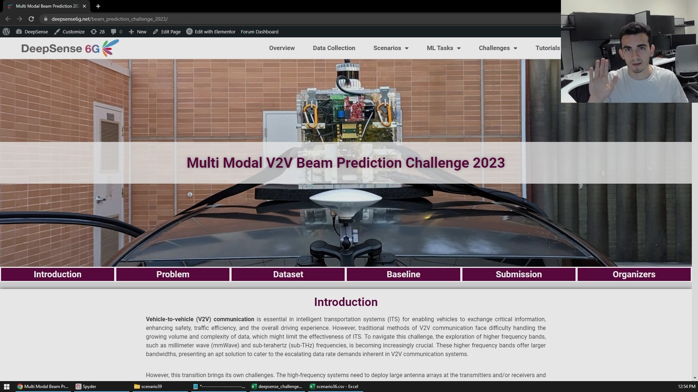

# Multi-Modal V2V Beam Prediction Challenge 2023 Baseline & Starter Scripts
Baseline for the DeepSense6G Beam Prediction Challenge 2023 based on V2V datasets. 

## Requirements to run the code

The Python environment used is exported in ```deepsense-env.txt```, but most of them are not 
necessary. All that is necessary to run the scripts is a basic Python installation and the
modules: 
- NumPy
- SciPy
- Pandas
- tqdm
- Pickle
- Matplotlib

Here are the recommended steps to setup a Python environment that can run this code:

1. Install Mambaforge -> https://github.com/conda-forge/miniforge#mambaforge
2. Open Miniforge Prompt and create a new environment
```mamba create -n deepsense-challenge```
3. Install the required packages
```mamba install numpy scipy pandas tqdm pickle matplotlib```

## Problem and Code Explanation

[](https://youtu.be/1D3PAe5uKVM)
(*click the image for watching the video*)

Outline of the video:
1. Problem & provided data: 3 pieces of information in 4 files
2. Necessary data and folder structure:
	- necessary data for competition -> GPS, optionally RGB, optionally CSVs/pre-loaded dicts
	- necessary data for benchmark   -> GPS and PWR and pre-loaded dicts
3. Pyhon environment setup
4. Two different ways of loading the data: fast for training and slow for testing 
5. Loading & Display images
6. Baseline approach and code
7. Output results in submission format
8. Evaluation metric/score

# FAQs

(no questions yet)
